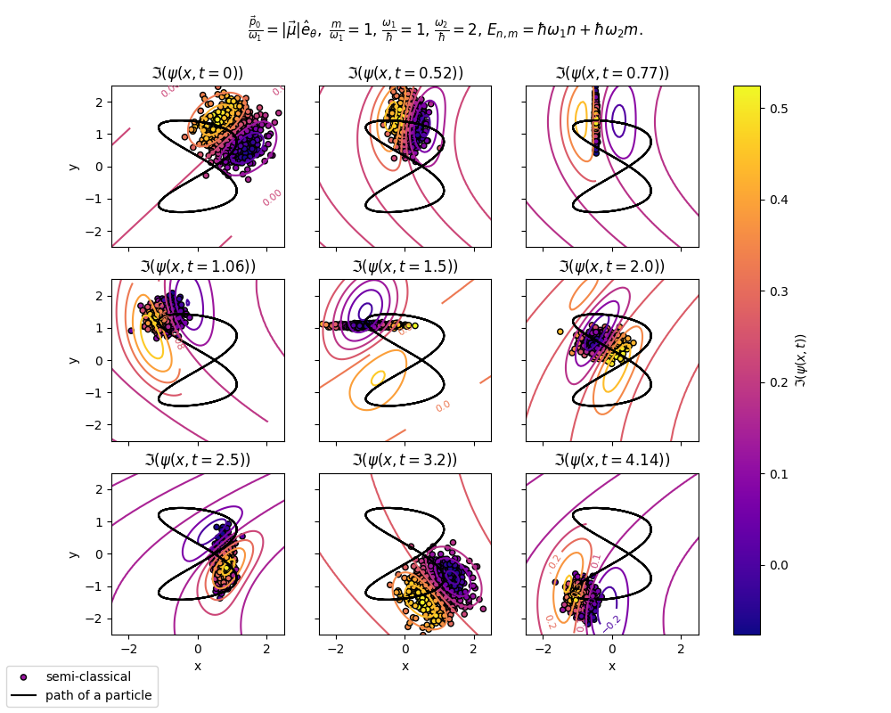

# Hamilton-Jacobi Equation and Semi-Classical Approximation

## Overview

This project implements a semi-classical approximation for quantum time evolution, focusing on the Hamilton-Jacobi equation. The method combines classical dynamics with quantum corrections and is tested on systems such as the quantum harmonic oscillator. The goal is to evaluate the accuracy and limitations of this approach in predicting quantum phenomena.

## Methodology

We derived the semi-classical approximation using an Ansatz for the wave function:

$$
\psi(\vec{r}, t) = e^{\frac{i}{\hbar}S(\vec{r}, t)}, \quad \text{where} \quad S(\vec{r}, t) = \sum_{n} \left( \frac{\hbar}{i} \right)^n S_n(\vec{r}, t)
$$

Expanding the Schrödinger equation in powers of $\hbar$ and truncating at first order gives two key equations:

1. The **Hamilton-Jacobi equation**, which governs the classical phase $S_0$:

$$\partial_t S_0 + H\left(\vec{\nabla}_r S_0, \vec{r} \right) = 0$$

2. A second equation for the amplitude $S_1$, which is related to the particle density:

$$
\partial_t S_1 + \frac{\vec{\nabla}_r S_0}{m} \cdot \vec{\nabla}_r S_1 + \frac{1}{2m} \vec{\nabla}_r \cdot \vec{\nabla}_r S_0 = 0
$$

A numerical method was implemented to solve these equations based on classical trajectories of particles goveren by the Hamiltonian system. Classical trajectories were simulated to approximate quantum dynamics.
## Results

- The method accurately reproduces the expected wave function behavior for the quantum harmonic oscillator, including its waveform and motion.
- However, discrepancies arise at classical turning points, where the wave function collapses into a delta-like peak.
- The semi-classical method fails to account for the zero-point energy of the quantum harmonic oscillator, leading to a phase difference in the results.

## Limitations and Discussion

The main challenge observed in this study was multiple solutions for identical coordinates in asymmetric and symmetric potentials. This points to issues with the semi-classical approximation when applied to systems beyond the harmonic oscillator. We suggest investigating the Hamilton-Jacobi equation using the Hopf-Lax formula to resolve these issues and achieve more consistent results.

## Future Work

- Explore alternative solutions for the Hamilton-Jacobi equation.
- Apply the method to more complex Hamiltonian systems.
- Investigate corrections to account for zero-point energy.

For further details, see the attached report. 
